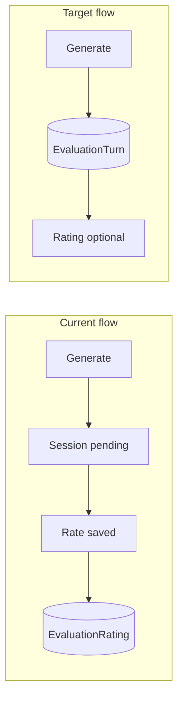
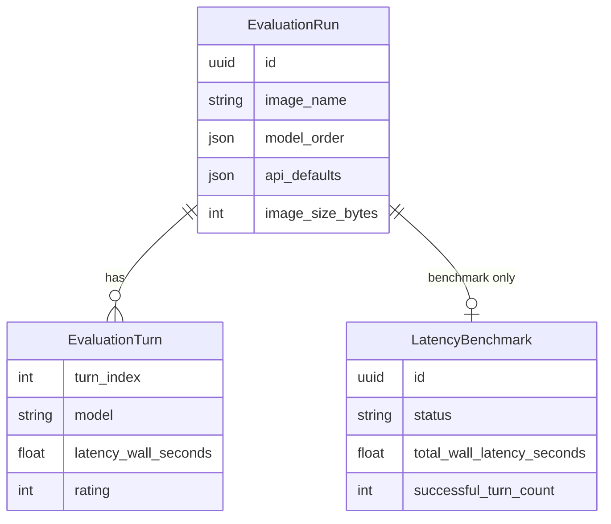
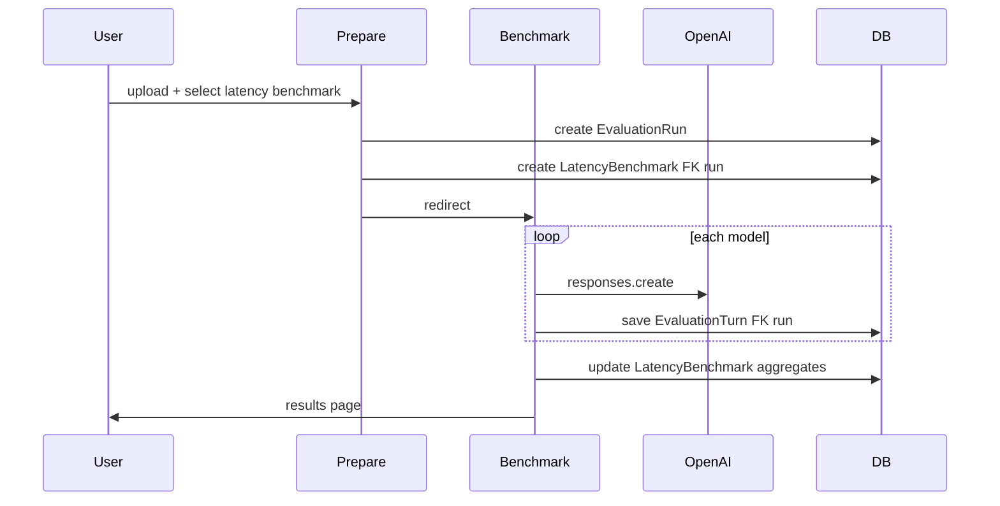

# Comprehensive Metadata and Turn-Based Recording

## Problem

Today, API results live in the session until a rating is saved. [`EvaluationRating`](image_evaluator/models.py) conflates **model turn data** with **human judgment**, so:

- Generated-but-unrated turns are lost on reset/abandon
- Reasoning effort, image detail, `store`, and other request params are hardcoded in [`openai_eval.py`](image_evaluator/services/openai_eval.py) and never stored
- Only `latency_seconds`, `input_tokens`, `output_tokens` are kept — missing reasoning tokens, cache tokens, OpenAI response id/status, server-side timestamps
- Run completion requires all ratings, not all generations



## Data model

Three-layer structure: shared **run** + **turns**, with benchmarks in a **dedicated table** linked by FK (no `mode` enum on `EvaluationRun`).



### `EvaluationRun` (shared parent for all sessions)

| Field | Purpose |
|-------|---------|
| `status` | `in_progress`, `completed`, `abandoned` |
| `completed_at` | When session finished |
| `image_size_bytes`, `image_width`, `image_height` | Image metadata via Pillow on upload |
| `api_defaults` | JSON snapshot of default request params for this run |

Keep existing: `image`, `image_name`, `image_content_type`, `prompt`, `model_order`, `created_at`.

**No `mode` field.** Run type is determined by presence of related records:
- Blind comparison: `EvaluationRun` with turns (some may have ratings); no `LatencyBenchmark` row
- Latency benchmark: `EvaluationRun` + linked `LatencyBenchmark` row

Properties:
- `is_benchmark` → `hasattr(self, 'latency_benchmark')`
- `turn_count` / `generated_count` / `rated_count`
- `is_complete`: blind = all turns generated and rated; benchmark = all turns generated and `LatencyBenchmark.status=completed`

### `LatencyBenchmark` (dedicated table, FK to run)

| Field | Purpose |
|-------|---------|
| `run` | `OneToOneField(EvaluationRun, on_delete=CASCADE, related_name='latency_benchmark')` |
| `status` | `in_progress`, `completed`, `abandoned` |
| `started_at` | When auto-run began |
| `completed_at` | When all models finished |
| `turn_count_expected` | `len(model_order)` at creation |
| `successful_turn_count` | Turns with `status=success` |
| `failed_turn_count` | Turns with `status=error` |
| `total_wall_latency_seconds` | Sum of `turn.latency_wall_seconds` (nullable until complete) |
| `avg_wall_latency_seconds` | Computed on completion |
| `notes` | Optional free-text (admin / future use) |

Turn-level latency detail stays in `EvaluationTurn` (FK to `run`). `LatencyBenchmark` holds **session-level aggregates** for easy querying:

```python
LatencyBenchmark.objects.filter(status='completed').select_related('run')
```

### `EvaluationTurn` (replaces `EvaluationRating`)

One row per model call (one evaluation with 3 models = 3 turns).

**Identity / sequence**
- `run` FK, `turn_index`, `sample_label`, `model` (requested)

**API outcome**
- `status`: `success` | `error`
- `response_text`, `error_message`, `error_type`
- `openai_response_id`, `response_model` (actual model from API), `openai_status`

**Human judgment (nullable — blind mode only)**
- `rating`, `notes`, `rated_at`

**Latency (primary focus)**
- `request_started_at`, `request_finished_at` (UTC, set around the API call)
- `latency_wall_seconds` (client-side, high precision)
- `latency_openai_seconds` (from response `completed_at - created_at` when available)

Reserved for future streaming/TTFB work: add nullable `time_to_first_token_seconds` now (always null until streaming is implemented).

**Token usage (explicit columns + raw JSON backup)**
- `input_tokens`, `output_tokens`, `total_tokens`
- `reasoning_tokens`, `cached_tokens`, `cache_write_tokens`
- `usage_raw` JSON (full `response.usage` dump)

**Request / response metadata**
- `api_request` JSON: `{reasoning, max_output_tokens, store, image_detail, ...}`
- `api_response` JSON: `{id, status, created_at, completed_at, model, ...}` (sanitized `model_dump()`)

**Timestamps**
- `generated_at` (when turn row first saved)
- `updated_at`

Unique constraint: `(run, turn_index)`.

### Migration strategy

1. Create `EvaluationTurn` and `LatencyBenchmark`
2. Extend `EvaluationRun` (status, image metadata, `api_defaults`; remove any `mode` if added)
3. Data migration: copy `EvaluationRating` → `EvaluationTurn`
4. Drop `EvaluationRating`
5. Update admin, views, CSV, tests

## Service layer

Refactor [`image_evaluator/services/openai_eval.py`](image_evaluator/services/openai_eval.py):

- Introduce `ApiRequestConfig` dataclass (reasoning effort, max_output_tokens, store, image_detail) — values from settings defaults, overridable per run
- Expand `AnalysisResult` to carry all fields above; extract from `response` via `model_dump()` where useful
- Add `record_failed_turn(...)` helper for exceptions (store error type/message, timestamps, partial latency)
- Centralize request building so probe + eval share the same param surface

Add settings in [`config/settings.py`](config/settings.py):

```python
OPENAI_DEFAULT_REASONING_EFFORT = "low"
OPENAI_DEFAULT_MAX_OUTPUT_TOKENS = 1600
OPENAI_DEFAULT_IMAGE_DETAIL = "auto"
OPENAI_DEFAULT_STORE = False
```

## View / flow changes

### Blind comparison (existing UX, richer persistence)

In [`image_evaluator/views.py`](image_evaluator/views.py):

1. **On `generate`**: immediately `EvaluationTurn.objects.update_or_create(...)` with full metadata; session stores only `turn_id`
2. **On `rate`**: update the existing turn's `rating`, `notes`, `rated_at`
3. **On API error**: persist an `error` turn row (not just session message)
4. **On reset / abandon**: mark run `status=abandoned` if any turns exist but run incomplete
5. **Results / CSV**: read from `turns`, include all new latency + API columns; rating columns empty for unrated turns

### Latency benchmark mode

- Add run-type selector on prepare form (`blind_comparison` vs `latency_benchmark` — form/UI only, not stored on `EvaluationRun`)
- On benchmark submit: create `EvaluationRun` + `LatencyBenchmark(run=..., status=in_progress, started_at=now)`
- New route: `run/<uuid>/benchmark/` — auto-loops models, saves each `EvaluationTurn`, updates `LatencyBenchmark` aggregates on completion
- Results page: load via `run.latency_benchmark`; show model names + latency columns (no ratings)
- CSV export: dedicated benchmark export or `benchmark_id` column linking to `LatencyBenchmark.id`



## CSV / admin

- [`DownloadCsvView`](image_evaluator/views.py): export all turn fields; include `benchmark_id` when `run.latency_benchmark` exists
- [`admin.py`](image_evaluator/admin.py):
  - `EvaluationTurnInline` on `EvaluationRun`
  - Dedicated `LatencyBenchmarkAdmin` with `run` FK, aggregate latency columns, inline turns
  - Filter benchmarks by `status`, date range

## Tests

- Unit tests for metadata extraction from mocked OpenAI `Response`
- View tests: generate persists turn before rate; error turn persisted; partial run queryable
- Benchmark view test (mocked `analyze_image` chain)
- Update existing tests referencing `EvaluationRating`

## Files to change

| File | Change |
|------|--------|
| [`image_evaluator/models.py`](image_evaluator/models.py) | `EvaluationTurn`, `LatencyBenchmark` (FK to run), extend `EvaluationRun`, remove `EvaluationRating` |
| `image_evaluator/migrations/` | schema + data migration |
| [`image_evaluator/services/openai_eval.py`](image_evaluator/services/openai_eval.py) | expanded `AnalysisResult`, `ApiRequestConfig` |
| [`image_evaluator/views.py`](image_evaluator/views.py) | persist on generate, benchmark view, abandon status |
| [`image_evaluator/forms.py`](image_evaluator/forms.py) | mode field |
| Templates | prepare mode toggle, benchmark progress, results/CSV by mode |
| [`image_evaluator/urls.py`](image_evaluator/urls.py) | benchmark route |
| [`config/settings.py`](config/settings.py) | default API params |
| [`image_evaluator/admin.py`](image_evaluator/admin.py) | turn admin |
| Tests | new + updated |

## Out of scope (future-ready only)

- Streaming / TTFB measurement (column reserved, not populated)
- User identity / auth
- Cross-run aggregate analytics dashboard
- Background/celery for benchmark runs (sequential in-request is fine for now)

## Expected outcome

- Every model call is a durable `EvaluationTurn` row the moment it completes (or fails)
- Partial and abandoned runs remain queryable with full latency + API metadata
- Blind comparison unchanged for users, but ratings attach to existing turns
- Latency benchmarks persisted in dedicated `LatencyBenchmark` table (FK to `EvaluationRun`) with session aggregates; per-model detail in `EvaluationTurn`
