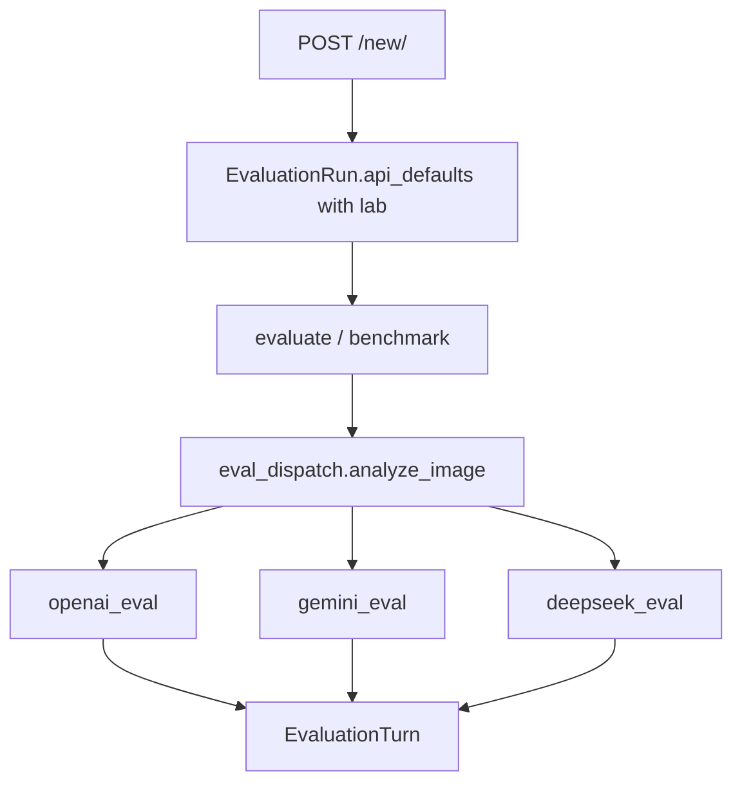

# Parallel Gemini and DeepSeek labs

Keep **one lab per session** (already how [`prepare.html`](image_evaluator/templates/image_evaluator/prepare.html) works). Do not mix OpenAI, Gemini, and DeepSeek models in a single run. Do not build a Provider ABC — three parallel eval modules plus a ~20-line dispatcher.

Official IDs (do not invent; re-check SDK types at implement time):

- **Google** (`MODEL_LABS["google"]`, `enabled: True`): `gemini-2.5-pro`, `gemini-2.5-flash`, `gemini-2.5-flash-lite`, `gemini-3.6-flash`, `gemini-3.5-flash`, `gemini-3.1-pro-preview`, `gemini-3.1-flash-lite`. Skip image-generation SKUs (`*-flash-image`).
- **DeepSeek** (`enabled: True`): only `deepseek-v4-flash-vision-exp` (hosted vision as of 2026-08-21).
- **OpenAI**: unchanged.

Allow **≥1 model** on prepare (needed for DeepSeek; also applies to other labs). Blind of one model is a single generate → rate → reveal.

## 1. Parallel services (redundant on purpose)

Leave [`openai_eval.py`](image_evaluator/services/openai_eval.py) as the OpenAI Responses path. Add:

- [`image_evaluator/services/gemini_eval.py`](image_evaluator/services/gemini_eval.py) — `google-genai` `client.models.generate_content`. Map `run.instructions` → `GenerateContentConfig.system_instruction` (omit when empty); user parts = optional text + `Part.from_bytes`. Wall latency = `perf_counter` around the call.
- [`image_evaluator/services/deepseek_eval.py`](image_evaluator/services/deepseek_eval.py) — existing `openai` SDK with `base_url="https://api.deepseek.com"` and `DEEPSEEK_API_KEY`. Use **Responses** (same image shape as OpenAI: `input_image` + `detail`) so snapshots stay comparable, but **do not** import OpenAI’s effort/mode/store lists.
- [`image_evaluator/services/eval_dispatch.py`](image_evaluator/services/eval_dispatch.py) — `analyze_image(lab=..., model=..., api_defaults=..., ...)` routes on `lab`. Views stop importing `openai_eval.analyze_image` directly.

Move shared `AnalysisResult` (persistence DTO) to a small [`image_evaluator/services/analysis.py`](image_evaluator/services/analysis.py) so Gemini/DeepSeek do not import `openai_eval`. Keep existing DB column names (`openai_response_id`, `latency_openai_seconds`, …); map provider id/status/usage into them. **No schema migration.** Relabel UI to “Provider (s)” / “Provider response ID”. If Gemini has no honest server timestamps, leave `latency_openai_seconds` null (wall is the benchmark metric).

Each lab gets its own frozen config dataclass (`ApiRequestConfig` stays OpenAI-only):

**Gemini snapshot** (both thinking styles stored; **one sent per turn**):

- `thinking_level`: official 3.x enum `minimal` / `low` / `medium` / `high` (default `medium`). Used only when `model.startswith("gemini-3")`.
- `thinking_budget`: integer, default `-1` (dynamic). Used only when `model.startswith("gemini-2.5-")`. Docs: 2.5 does not support `thinkingLevel`; sending `thinkingBudget` on Gemini 3 can misbehave — never send both on one request.
- `media_resolution`: from installed `google.genai.types.MediaResolution` (expect `low` / `medium` / `high`; skip per-part `ultra_high`). Default **high** (docs recommendation for images).
- `max_output_tokens`
- Shared metadata: `lab`, `omit_instructions`, `prompt_preset`

If the API rejects a combo (e.g. `thinking_budget=0` on 2.5 Pro, `minimal` on 3.1 Pro), persist `EvaluationTurn` `status=error` — no silent remap.

**DeepSeek snapshot** ([Thinking Mode](https://api-docs.deepseek.com/guides/thinking_mode/) + [Vision](https://api-docs.deepseek.com/guides/vision/)):

- Responses `reasoning.effort`: **`none` / `low` / `high` / `max` only** (not OpenAI’s `minimal`/`medium`/`xhigh`). Default `high`. `none` disables thinking.
- `image_detail`: `auto` / `low` / `high` / `original` (DeepSeek table; `high` ≡ `original`, `auto` ≡ `original` today).
- `max_output_tokens`
- Do **not** send OpenAI `store` or `reasoning.mode` unless DeepSeek docs list them.

`compose_eval_text()` stays shared. Prompt presets are lab-agnostic.

## 2. Catalog, keys, validation

[`config/settings.py`](config/settings.py): enable google/deepseek with the IDs above; add `GEMINI_API_KEY` and `DEEPSEEK_API_KEY` via `python-decouple`. Root [`.env.example`](.env.example) only (placeholders). Never put keys in the form or SQLite.

[`AVAILABLE_MODELS`](config/settings.py) must **not** be fed to OpenAI `models.list()` once Gemini/DeepSeek IDs exist. OpenAI validation uses `models_for_lab("openai")` only.

Per-lab key check:

- Prepare **GET** always renders the form (today a missing `OPENAI_API_KEY` 503s the whole page).
- Validate **the selected lab’s** key on prepare POST and on evaluate/benchmark (from `run.api_defaults["lab"]`).
- Session cache keyed by lab (`api_key_status_openai`, etc.).
- Missing/invalid templates: lab-aware copy, not “OpenAI API key problem” for Gemini.

Live probes stay optional and tagged: existing `@tag("openai")`; add `@tag("gemini")` and `@tag("deepseek")`. Default test command remains `--exclude-tag=openai` (extend exclude for the new tags or keep live tests opt-in by tag only).

Add `google-genai` to [`requirements.txt`](requirements.txt).

## 3. Form and prepare UI

[`PrepareEvaluationForm`](image_evaluator/forms.py):

- Keep all fields; **validate/snapshot only the selected lab’s options** (`clean()` / `api_defaults_dict()` branch on `lab`).
- `clean_models`: at least **one** model, still must belong to that lab.
- Gemini fields: `thinking_level`, `thinking_budget`, `media_resolution` (+ shared `max_output_tokens`).
- DeepSeek fields: `deepseek_reasoning_effort` (or similarly named), `image_detail`, `max_output_tokens`.
- OpenAI fields unchanged.

[`prepare.html`](image_evaluator/templates/image_evaluator/prepare.html): wrap API option groups in `data-lab="openai|google|deepseek"` fieldsets; reuse the existing lab-change JS that already shows/hides model checkboxes. Help text: Gemini thinking level = 3.x, thinking budget = 2.5.

Inspect/evaluate/benchmark sidebars: show the keys that exist on `api_defaults` for that lab (not a hardcoded OpenAI block). Site chrome: retitle from “OpenAI Image Evaluator” to **Vision Model Evaluator**.

## 4. Views

[`views.py`](image_evaluator/views.py): `_api_config_for_run` becomes lab-aware (or just pass `run.api_defaults` into the dispatcher). `_check_api_key` takes a lab id. Generate/benchmark/error turns call `eval_dispatch.analyze_image` / `build_api_request_dict` with `lab`.

[`turns.py`](image_evaluator/services/turns.py) `build_api_request_dict` must snapshot the **lab’s** request shape (not always OpenAI `reasoning.mode`).

## 5. Tests and docs

- Snapshot tests: Google POST stores thinking_level + thinking_budget + media_resolution, **not** OpenAI `store`; DeepSeek stores `none/low/high/max` effort; generate patches dispatcher and asserts the right module/config.
- Unit tests with mocked `generate_content` / DeepSeek `responses.create`: 2.5 turn sends `thinking_budget` only; 3.x turn sends `thinking_level` only.
- Min-one-model prepare; DeepSeek single checkbox allowed.
- Key tests: OpenAI list is not required to contain Gemini IDs; missing Gemini key does not block OpenAI prepare.
- Run `.venv/bin/python manage.py test image_evaluator.tests --exclude-tag=openai`.
- Update [`docs/handoff.md`](docs/handoff.md), [`README.md`](README.md), [`AGENTS.md`](AGENTS.md). Do not edit `.cursor/plans/`.

Browser-verify `/new/` lab switch (fieldsets + models + key errors), then a mocked or live generate path per lab if the server is up.

**Out of scope:** mixing labs in one run, streaming/TTFB, USD cost, auth, image-generation models, renaming DB columns.