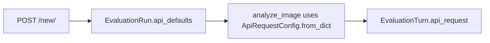

# Pickable API defaults (official enums)

## Sources (do not guess)

**Reasoning effort** comes from the installed OpenAI SDK (generated from OpenAPI) and the official reasoning guide:

- [openai/types/shared/reasoning_effort.py](file:///home/pmpmt/python/260829-vision-model-eval/vision-model-eval/.venv/lib/python3.12/site-packages/openai/types/shared/reasoning_effort.py): `Literal["none", "minimal", "low", "medium", "high", "xhigh", "max"]`
- [openai/types/shared_params/reasoning.py](file:///home/pmpmt/python/260829-vision-model-eval/vision-model-eval/.venv/lib/python3.12/site-packages/openai/types/shared_params/reasoning.py): same list; “Not all reasoning models support every value.”
- [Reasoning models | OpenAI API](https://developers.openai.com/api/docs/guides/reasoning): same seven values; model-dependent support.

Form choices (in that order): **none, minimal, low, medium, high, xhigh, max**. Default remains `OPENAI_DEFAULT_REASONING_EFFORT` (`low` in [`config/settings.py`](config/settings.py)).

GPT-5.6 also documents `reasoning.mode`: **standard** | **pro** (independent of effort). Add it as a constrained select, default **standard** (SDK/docs default). Snapshot in `api_defaults` as `"reasoning": {"effort": "...", "mode": "..."}` and pass both into `client.responses.create(...)`.

**Image detail** for Responses `input_image` (this app’s API): SDK `Literal["low", "high", "auto", "original"]` — default `auto`. Include **original**; do not use the older Chat Completions trio only.

**Store** is a boolean (`store` on Responses). **Max output tokens** is an integer (keep 1–128000). Prompt stays a textarea. All initials = current settings.py values.

## Already true vs missing

- Models + prompt are already on [`/new/`](image_evaluator/templates/image_evaluator/prepare.html).
- [`EvaluationRun.api_defaults`](image_evaluator/models.py) already exists (JSON). **No new columns.**
- Gap: generate/benchmark still call `analyze_image()` **without** the run snapshot, so they ignore chosen values. Error turns use `ApiRequestConfig.from_settings()`.

Partial work already in the tree (unfinished): [`ApiRequestConfig.from_dict`](image_evaluator/services/openai_eval.py) and extra fields on [`PrepareEvaluationForm`](image_evaluator/forms.py) with a **wrong** effort list (`none/low/medium/high`). Finish and correct those; do not leave guessed enums.

## Lab grouping (this increment: OpenAI only)

You asked to group by lab (OpenAI now; Gemini / DeepSeek later) with a select that includes/excludes models. **Do not wire extra providers or extra API keys in this change.** Keys stay in root `.env` (`OPENAI_API_KEY` only). Locked: never put keys in the form or SQLite.

Reshape catalog in settings from a flat list to labs:

```python
MODEL_LABS = {
    "openai": {
        "label": "OpenAI",
        "enabled": True,
        "models": ["gpt-5.6-luna", "gpt-5.6-terra", "gpt-5.6-sol"],
    },
    "google": {"label": "Google Gemini", "enabled": False, "models": []},
    "deepseek": {"label": "DeepSeek", "enabled": False, "models": []},
}
AVAILABLE_MODELS = [m for lab in MODEL_LABS.values() if lab["enabled"] for m in lab["models"]]
```

On `/new/`: lab select (disabled labs greyed out / “coming soon”), then checkboxes for that lab’s models. Keep at least two models required. Persist `model_order` as today; also store `"lab": "openai"` inside `api_defaults` so inspect/CSV show which lab was used.

Future labs = new catalog entries + a provider adapter. Out of scope now.



## Implementation

1. Fix effort/detail/mode choices on the form from SDK literals; keep current settings as `initial`.
2. [`_create_run`](image_evaluator/views.py) writes `form.api_defaults_dict()` instead of `default_api_defaults()`.
3. [`analyze_image`](image_evaluator/services/openai_eval.py) / [`build_api_request_dict`](image_evaluator/services/turns.py): pass `ApiRequestConfig.from_dict(run.api_defaults)` (include `reasoning.mode` when present).
4. [`prepare.html`](image_evaluator/templates/image_evaluator/prepare.html): lab select + API options group. Inspect/evaluate sidebar: show effort, mode, tokens, detail, store as scalars (JSON details stay).
5. Tests: prepare POST with `effort=xhigh` + `mode=pro` persists on the run; generate passes that config into `analyze_image`. Update [`docs/handoff.md`](docs/handoff.md) / README.
6. Add the convention below to [`AGENTS.md`](AGENTS.md) (Do + Do not). Keep existing error-turn persistence; if the API rejects a param (unsupported effort/mode/detail for that model), record `EvaluationTurn` with `status=error` and show the provider message on the evaluate/inspect pages (already the pattern — do not swallow or guess a fallback value).

**Do not:** add Gemini/DeepSeek clients, auth, a `mode` column on `EvaluationRun`, or store API keys in the DB.

## AGENTS.md addition (implement on execute)

Under **Do** / **Do not** in [`AGENTS.md`](AGENTS.md):

- **Do:** When adding form choices, settings lists, or API parameter enums (models, `reasoning.effort`, `reasoning.mode`, image `detail`, etc.), read the **current** official docs and the installed SDK types (e.g. `.venv/.../openai/types/...`). Do not invent or truncate the list from memory.
- **Do:** If the provider still rejects a value (model-dependent support), treat it as a failed API call: persist `EvaluationTurn` with `status=error`, `error_type`, `error_message`; surface it in the UI. Do not silently remap to another value.
- **Do not:** Guess enum members, copy stale lists from older Chat Completions docs when the app uses Responses, or catch API errors without writing a turn.
