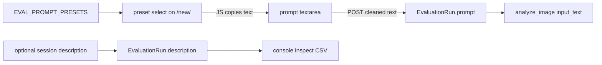

# Prompt presets now, library-ready later

## Locked

- **One image, one prompt, all models.** The textarea is still the source of what is sent. Presets only fill it.
- **`EvaluationRun.prompt` stays the snapshot** of the exact text sent. Do not add a prompt FK this increment; a later library must still copy text onto the run (same pattern as `api_defaults`).
- **No `instructions` / developer-message split** in this change.
- **No Prompt model, no save button, no clone-from-run UI** yet. Leave a stable catalog shape so those can attach later.
- **Session description is metadata only.** It is not sent to OpenAI and is not part of the frozen eval prompt. Store plain text now so it can be embedded later; do not add vector columns or search this increment.

## Current vs this change

Today: one textarea on [`prepare.html`](image_evaluator/templates/image_evaluator/prepare.html), initial from `DEFAULT_EVAL_PROMPT` in [`config/settings.py`](config/settings.py), stored by [`PrepareView`](image_evaluator/views.py) onto `EvaluationRun.prompt`. Runs have no human “why this session” field.

## Catalog

Add `EVAL_PROMPT_PRESETS` in [`config/settings.py`](config/settings.py) (same style as `MODEL_LABS`). Keep `DEFAULT_EVAL_PROMPT` as the body of the first preset so the default session text does not change.

Helpers in a small [`image_evaluator/prompt_presets.py`](image_evaluator/prompt_presets.py) (mirror [`model_catalog.py`](image_evaluator/model_catalog.py)):

- `preset_choices()` → `(id, label)` including `custom`
- `preset_texts()` → `{id: text}` for the template (JSON in a `<script>` or `data-*`)
- `default_preset_id()` / `default_prompt_text()` → current describe string

Suggested presets (all vision-eval, not generic chat):

- `describe` — current `DEFAULT_EVAL_PROMPT` (default)
- `ocr` — transcribe visible text, layout, language, uncertainty
- `inventory` — objects, counts, spatial relations
- `uncertainty` — what is occluded, unreadable, or ambiguous
- `custom` — do not overwrite the textarea

## Form and UI

[`PrepareEvaluationForm`](image_evaluator/forms.py):

- New `prompt_preset` `ChoiceField` (not required for the API; used only to drive the picker).
- Keep `prompt` as the required stripped textarea. **Edited text always wins on POST.** Do not replace `cleaned_data["prompt"]` with preset body if they diverge.

[`prepare.html`](image_evaluator/templates/image_evaluator/prepare.html):

- Preset `<select>` above the textarea.
- Existing lab-sync script: on preset change, if not `custom`, set `#id_prompt`. On textarea `input`, set select to `custom`.
- No extra CSS framework; match current inline styles.

`PrepareView` unchanged except it already passes `form.cleaned_data["prompt"]`. Existing API-defaults POSTs must include `prompt_preset` (or give the field a default so unbound/missing still validates). Prefer a default of `describe` so tests stay simple.

## Later library (do not build)

When adding save/reuse, extend the same dropdown:

- Static presets (this catalog) + saved rows (`Prompt` with `name`, `body`) + optional “from run …”
- Still copy `body` into `EvaluationRun.prompt` at session start
- Optional later: `GET /new/?from=<run_id>` to prefill prompt (and maybe API options)

Do not store prompt-only-by-id on the run.

## Session description (this increment)

Optional **aim of this session** — why you are running it (e.g. “OCR on faded shipping labels vs terra/sol”). Distinct from the eval prompt and from per-turn rating notes.

- New `description = models.TextField(blank=True, default="")` on [`EvaluationRun`](image_evaluator/models.py). Migration only; no embedding column.
- [`PrepareEvaluationForm`](image_evaluator/forms.py): optional `description` textarea (strip; empty allowed). Place it **above** the prompt group, labeled “Session description”, help text: “Optional. What this session is for — used to find it later.”
- [`_create_run`](image_evaluator/views.py): persist `form.cleaned_data["description"]`.
- **Do not** pass it into `analyze_image()` or `api_request`.
- Show when non-empty: inspect header, evaluate/benchmark sidebars, results; truncated on the [console](image_evaluator/templates/image_evaluator/console.html) run table (new column).
- CSV: add `session_description` next to `prompt` in [`_turn_csv_fields`](image_evaluator/views.py) / `_turn_csv_row`.

**Later (do not build):** embed `description` (optionally plus prompt / image name) into a separate vector column or table; SQLite-vec or PostgreSQL + pgvector when the DB is large. Keep the source text on `EvaluationRun.description` as the canonical string.

## Tests and docs

- New tests in [`image_evaluator/tests/test_prompt_presets.py`](image_evaluator/tests/test_prompt_presets.py) (or extend [`test_api_defaults.py`](image_evaluator/tests/test_api_defaults.py) if tiny): GET `/new/` includes preset labels; POST with custom textarea text persists that text, not the preset body; omitted description → `""`; provided description stored and shown on inspect/CSV.
- Update existing prepare POSTs if `prompt_preset` is required.
- Run `.venv/bin/python manage.py test image_evaluator.tests --exclude-tag=openai`
- Update [`docs/handoff.md`](docs/handoff.md) and a short README note under the prepare form / data model.

## Out of scope

- Developer `instructions` vs user prompt
- Per-model prompts
- Saving named prompts, clone-from-run
- Embeddings, vector index, or description search UI
